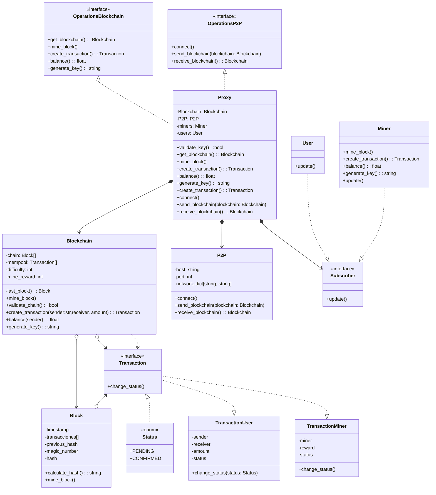

# UML

SSH key generation

```mermaid
classDiagram

class Proxy{
        -Blockchain: Blockchain
        -P2P: P2P
        -miners: Miner
        -users: User
        +validate_key():bool
        +get_blockchain(): Blockchain
        +mine_block()
        +create_transaction(): Transaction
        +balance(): float
        +generate_key(): string
        +create_transaction(): Transaction
        +connect()
        +send_blockchain(blockchain: Blockchain)
        +receive_blockchain(): Blockchain
    }

    class Blockchain{
        -chain: Block[]
        -mempool: Transaction[]
        -difficulty: int
        -mine_reward: int
        -last_block(): Block
        +mine_block()
        +validate_chain(): bool
        +create_transaction(sender:str,receiver, amount): Transaction
        +balance(sender): float
        +generate_key(): string
    }

    class OperationsBlockchain{
        <<interface>>
        +get_blockchain(): Blockchain
        +mine_block()
        +create_transaction(): Transaction
        +balance(): float
        +generate_key(): string
    }

    class P2P{
        -host: string
        -port: int
        -network: dict[string, string]
        +connect()
        +send_blockchain(blockchain: Blockchain)
        +receive_blockchain(): Blockchain
    }

    class OperationsP2P{
        <<interface>>
        +connect()
        +send_blockchain(blockchain: Blockchain)
        +receive_blockchain(): Blockchain
    }

    class Subscriber{
        <<interface>>
        +update()
    }

    class Miner{
        +mine_block()
        +create_transaction(): Transaction
        +balance(): float
        +generate_key(): string
        +update()
    }

    class User{
        +update()
    }

    class Block{
        -timestamp
        -transacciones[]
        -previous_hash
        -magic_number
        -hash

        +calculate_hash(): string
        +mine_block()
    }

    class Transaction{
        <<interface>>
        +change_status()
    }

    class Status{
        <<enum>>
        +PENDING
        +CONFIRMED
    }

    class TransactionUser{
        -sender
        -receiver
        -amount
        -status
        +change_status(status: Status)
    }

    class TransactionMiner{
        -miner
        -reward
        -status
        +change_status()
    }

    

    

    Blockchain o--> Block
    Transaction <--o Block
    Blockchain o--> Transaction
    Transaction <|.. Status  
    Transaction ..|> TransactionUser
    Transaction ..|> TransactionMiner
    Proxy *--> Blockchain
    OperationsBlockchain <|..Proxy 
    Blockchain ..> Transaction
    Proxy *--> P2P
    OperationsP2P <|.. Proxy 
    Proxy *--> Subscriber
    User ..|> Subscriber  
    Miner ..|> Subscriber

```
