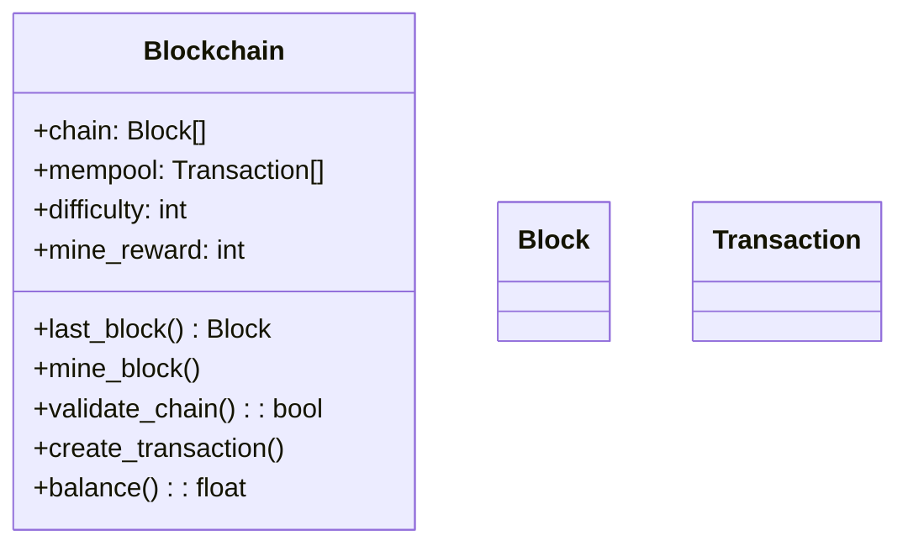

# UML

```mermaid
classDiagram
    class Blockchain{
        +chain: Block[]
        +mempool: Transaction[]
        +difficulty: int
        +mine_reward: int
        +last_block() Block
        +mine_block()
        +validate_chain(): bool
        +create_transaction()
        +balance(): float

    }

    class Block{

    }

    class Transaction{

    }
```
