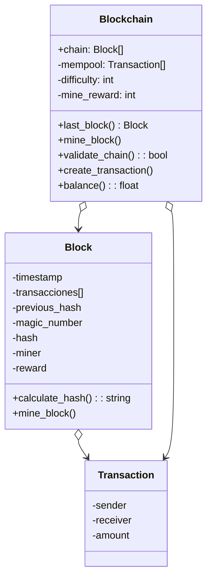

# UML

```mermaid
classDiagram
    class Blockchain{
        +chain: Block[]
        -mempool: Transaction[]
        -difficulty: int
        -mine_reward: int
        +last_block() Block
        +mine_block()
        +validate_chain(): bool
        +create_transaction()
        +balance(): float

    }

    class Block{
        -timestamp
        -transacciones[]
        -previous_hash
        -magic_number
        -hash
        -miner
        -reward

        +calculate_hash(): string
        +mine_block()
    }

    class Transaction{
        -sender
        -receiver
        -amount
    }
    Blockchain o--> Block
    Block o--> Transaction
    Blockchain o--> Transaction
```
