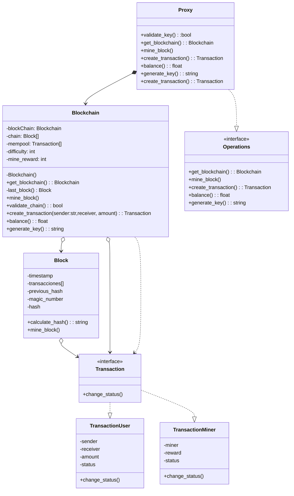

# UML

SSH key generation

```mermaid
classDiagram
    class Blockchain{
        -blockChain: Blockchain
        -chain: Block[]
        -mempool: Transaction[]
        -difficulty: int
        -mine_reward: int
        -Blockchain()
        +get_blockchain(): Blockchain
        -last_block() Block
        +mine_block()
        +validate_chain(): bool
        +create_transaction(sender:str,receiver, amount): Transaction
        +balance(): float
        +generate_key(): string

    }

    class Block{
        -timestamp
        -transacciones[]
        -previous_hash
        -magic_number
        -hash

        +calculate_hash(): string
        +mine_block()
    }

    class Transaction{
        <<interface>>
        +change_status()
    }

    class TransactionUser{
        -sender
        -receiver
        -amount
        -status
        +change_status()
    }

    class TransactionMiner{
        -miner
        -reward
        -status
        +change_status()
    }

    class Proxy{
        +validate_key():bool
        +get_blockchain(): Blockchain
        +mine_block()
        +create_transaction(): Transaction
        +balance(): float
        +generate_key(): string
        +create_transaction(): Transaction
    }

    class Operations{
        <<interface>>
        +get_blockchain(): Blockchain
        +mine_block()
        +create_transaction(): Transaction
        +balance(): float
        +generate_key(): string
    }

    Blockchain o--> Block
    Block o--> Transaction
    Blockchain o--> Transaction
    Transaction ..|> TransactionUser
    Transaction ..|> TransactionMiner
    Proxy *--> Blockchain
    Proxy ..|> Operations
    Blockchain ..> Transaction
```
