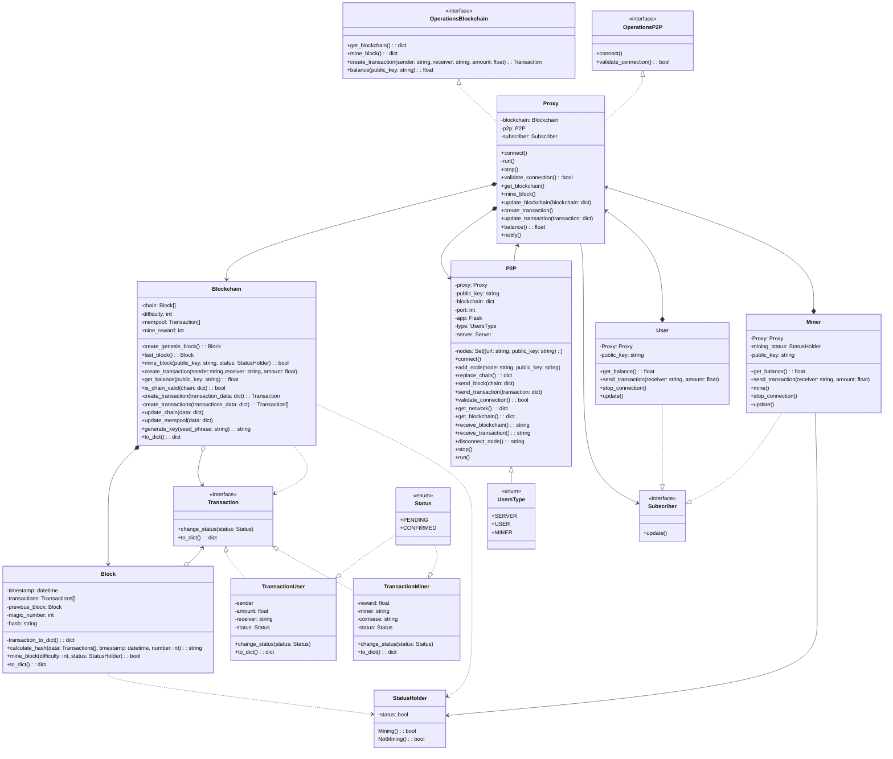

# UML

SSH key generation

```mermaid
classDiagram

    Blockchain *--> Block
    Transaction <--o Block
    Blockchain o--> Transaction
    Transaction <|.. TransactionUser
    Transaction <|.. TransactionMiner
    Proxy *--> Blockchain
    OperationsBlockchain <|..Proxy 
    Blockchain ..> Transaction
    Proxy *--> P2P
    Proxy <-- P2P 
    OperationsP2P <|.. Proxy 
    Proxy --> Subscriber
    Status ..|> TransactionUser 
    Status ..|> TransactionMiner   
    Miner ..|> Subscriber
    User ..|> Subscriber  
    Proxy <--* User
    Proxy <--* Miner
    P2P <|-- UsersType
    Block ..> StatusHolder
    Blockchain ..> StatusHolder
    Miner --> StatusHolder

    class OperationsP2P{
        <<interface>>
        +connect()
        +validate_connection(): bool
    }

    class OperationsBlockchain{
        <<interface>>
        +get_blockchain(): dict
        +mine_block(): dict
        +create_transaction(sender: string, receiver: string, amount: float): Transaction
        +balance(public_key: string): float
    }
    
    class Proxy{
        -blockchain: Blockchain
        -p2p: P2P
        -subscriber: Subscriber
        +connect()
        -run()
        +stop()
        +validate_connection():bool
        +get_blockchain()
        +mine_block()
        +update_blockchain(blockchain: dict)
        +create_transaction()
        +update_transaction(transaction: dict)
        +balance(): float
        +notify()
    }

    class Blockchain{
        -chain: Block[]
        -difficulty: int
        -mempool: Transaction[]
        -mine_reward: int
        -create_genesis_block(): Block
        +last_block(): Block
        +mine_block(public_key: string, status: StatusHolder): bool
        +create_transaction(sender:string,receiver: string, amount: float)
        +get_balance(public_key: string): float
        +is_chain_valid(chain: dict): bool
        -create_transaction(transaction_data: dict): Transaction
        -create_transactions(transactions_data: dict): Transaction[]
        +update_chain(data: dict)
        +update_mempool(data: dict)
        +generate_key(seed_phrase: string): string
        +to_dict(): dict
    }

    class P2P{
        -proxy: Proxy
        -public_key: string
        -blockchain: dict
        -port: int
        -app: Flask
        -nodes: Set[(url: string, public_key: string)]
        -type: UsersType
        -server: Server
        +connect()
        +add_node(node: string, public_key: string)
        +replace_chain(): dict
        +send_block(chain: dict)
        +send_transaction(transaction: dict)
        +validate_connection(): bool
        +get_network(): dict
        +get_blockchain(): dict
        +receive_blockchain(): string
        +receive_transaction(): string
        +disconnect_node(): string
        +stop()
        +run()

    }

    class UsersType{
        <<enum>>
        +SERVER
        +USER
        +MINER
    }

    class Subscriber{
        <<interface>>
        +update()
    }

    class User{
        -Proxy: Proxy
        -public_key: string
        +get_balance(): float
        +send_transaction(receiver: string, amount: float)
        +stop_connection()
        +update()
    }

    class Miner{
        -Proxy: Proxy
        -mining_status: StatusHolder
        -public_key: string
        +get_balance(): float
        +send_transaction(receiver: string, amount: float)
        +mine()
        +stop_connection()
        +update()
    }

    class Block{
        -timestamp: datetime
        -transactions: Transactions[]
        -previous_block: Block
        -magic_number: int
        -hash: string
        -transaction_to_dict(): dict
        +calculate_hash(data: Transactions[], timestamp: datetime, number: int): string
        +mine_block(difficulty: int, status: StatusHolder): bool
        +to_dict(): dict
    }

    class StatusHolder{
        -status: bool
        Mining() : bool
        NotMining() : bool
    }

    class Transaction{
        <<interface>>
        +change_status(status: Status)
        +to_dict(): dict
    }

    class Status{
        <<enum>>
        +PENDING
        +CONFIRMED
    }

    class TransactionUser{
        -sender
        -amount: float
        -receiver: string
        -status: Status
        +change_status(status: Status)
        +to_dict(): dict
    }

    class TransactionMiner{
        -reward: float
        -miner: string
        -coinbase: string
        -status: Status
        +change_status(status: Status)
        +to_dict(): dict
    }


```
